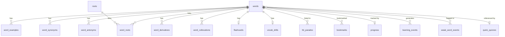

# WordSmart Database Schema

> **Database**: `app/assets/wordsmart.db` (SQLite)
> **Total Tables**: 27
> **Total Pre-loaded Records**: ~21,259

---

## Table of Contents

1. [Overview](#overview)
2. [Entity-Relationship Diagram](#entity-relationship-diagram)
3. [Core Vocabulary Tables](#core-vocabulary-tables)
4. [Quiz & Assessment Tables](#quiz--assessment-tables)
5. [User Progress & Analytics Tables](#user-progress--analytics-tables)
6. [Reference Tables](#reference-tables)
7. [Indexes](#indexes)

---

## Overview

The WordSmart database is organized into four logical groups:

| Group | Tables | Description |
|-------|--------|-------------|
| **Core Vocabulary** | `words`, `word_examples`, `word_synonyms`, `word_antonyms`, `word_derivatives`, `word_collocations`, `roots`, `word_roots`, `flashcards` | Word definitions, linguistic data, and flashcard content |
| **Quiz & Assessment** | `vocab_drills`, `contextual_stories`, `mcq_quizzes`, `quick_quizzes`, `advanced_sat_gre_quizzes`, `final_exam` | Various quiz formats and exam content |
| **User Progress** | `bookmarks`, `progress`, `study_sessions`, `learning_events`, `quiz_attempts`, `story_progress`, `daily_goals`, `learning_profile`, `weak_word_events`, `milestones` | Tracks user learning state, scores, and goals |
| **Reference** | `hit_parades`, `specialized_vocabulary` | Curated word lists and domain-specific terms |

---

## Entity-Relationship Diagram



---

## Core Vocabulary Tables

### `words` — 1,913 rows

The central entity of the entire database. Every word-related table references this table.

| Column | Type | Constraints | Description |
|--------|------|-------------|-------------|
| `id` | INTEGER | PRIMARY KEY | Unique word identifier |
| `word` | TEXT | UNIQUE, NOT NULL | The vocabulary word |
| `pronunciation` | TEXT | — | Phonetic pronunciation |
| `part_of_speech` | TEXT | — | e.g. noun, verb, adjective |
| `definition` | TEXT | — | English definition |
| `bengali_meaning` | TEXT | — | Bengali translation |
| `mnemonic` | TEXT | — | Memory aid / trick |
| `level` | TEXT | — | Difficulty level grouping |
| `audio` | TEXT | — | Audio file reference |
| `quick_quiz_id` | INTEGER | — | Links to `quick_quizzes.quiz_id` |


**Example Row:**
```json
{
  "id": 1,
  "word": "ABASH",
  "pronunciation": "uh BASH",
  "part_of_speech": "v",
  "definition": "to make ashamed; to embarrass",
  "bengali_meaning": "লজ্জিত করা, অপ্রস্তুত করা, বিব্রত করা",
  "mnemonic": "A BASH-ful person might ABASH easily, feeling embarrassed.",
  "level": "beginner",
  "audio": "audio/ABASH.mp3",
  "quick_quiz_id": 1
}
```

---


### `word_examples` — 2,353 rows

Usage examples for each word.

| Column | Type | Constraints | Description |
|--------|------|-------------|-------------|
| `id` | INTEGER | PK, AUTOINCREMENT | Unique example ID |
| `word_id` | INTEGER | NOT NULL, FK → `words(id)` | Parent word |
| `example_text` | TEXT | NOT NULL | Example sentence in English |
| `translation` | TEXT | — | Bengali translation of the example |

**Relationship**: Many-to-One → `words` (ON DELETE CASCADE)


**Example Row:**
```json
{
  "id": 1,
  "word_id": 1,
  "example_text": "Meredith felt **abashed** by her inability to remember her lines in the school chorus of \"Old McDonald Had a Farm.\"",
  "translation": "স্কুলের কোরাসে \"ওল্ড ম্যাকডোনাল্ড হ্যাড এ ফার্ম\" গাইতে গিয়ে নিজের অংশ মনে রাখতে না পারায় মেরডিথ বেশ অপ্রস্তুত বোধ করছিলেন।"
}
```

---


### `word_synonyms` — 4,107 rows

Synonyms associated with each word.

| Column | Type | Constraints | Description |
|--------|------|-------------|-------------|
| `id` | INTEGER | PK, AUTOINCREMENT | Unique synonym record ID |
| `word_id` | INTEGER | NOT NULL, FK → `words(id)` | Parent word |
| `synonym` | TEXT | NOT NULL | A synonym of the word |

**Relationship**: Many-to-One → `words` (ON DELETE CASCADE)


**Example Row:**
```json
{
  "id": 1,
  "word_id": 1,
  "synonym": "embarrass"
}
```

---


### `word_antonyms` — 4,087 rows

Antonyms associated with each word.

| Column | Type | Constraints | Description |
|--------|------|-------------|-------------|
| `id` | INTEGER | PK, AUTOINCREMENT | Unique antonym record ID |
| `word_id` | INTEGER | NOT NULL, FK → `words(id)` | Parent word |
| `antonym` | TEXT | NOT NULL | An antonym of the word |

**Relationship**: Many-to-One → `words` (ON DELETE CASCADE)


**Example Row:**
```json
{
  "id": 1,
  "word_id": 1,
  "antonym": "encourage"
}
```

---


### `word_derivatives` — 1,045 rows

Derivative forms of each word (e.g., "happy" → "happiness", "happily").

| Column | Type | Constraints | Description |
|--------|------|-------------|-------------|
| `id` | INTEGER | PK, AUTOINCREMENT | Unique derivative record ID |
| `word_id` | INTEGER | NOT NULL, FK → `words(id)` | Parent word |
| `derivative_word` | TEXT | NOT NULL | The derived word form |
| `part_of_speech` | TEXT | NOT NULL | Part of speech of the derivative |

**Relationship**: Many-to-One → `words` (ON DELETE CASCADE)


**Example Row:**
```json
{
  "id": 1,
  "word_id": 1,
  "derivative_word": "abashment",
  "part_of_speech": "n"
}
```

---


### `word_collocations` — 3,434 rows

Common word pairings / collocations.

| Column | Type | Constraints | Description |
|--------|------|-------------|-------------|
| `id` | INTEGER | PK, AUTOINCREMENT | Unique collocation record ID |
| `word_id` | INTEGER | NOT NULL, FK → `words(id)` | Parent word |
| `collocation` | TEXT | NOT NULL | A common collocation |

**Relationship**: Many-to-One → `words` (ON DELETE CASCADE)


**Example Row:**
```json
{
  "id": 1,
  "word_id": 1,
  "collocation": "feel abashed"
}
```

---


### `roots` — 188 rows

Latin/Greek root morphemes used to build vocabulary understanding.

| Column | Type | Constraints | Description |
|--------|------|-------------|-------------|
| `id` | INTEGER | PK, AUTOINCREMENT | Unique root ID |
| `root` | TEXT | UNIQUE, NOT NULL | The root morpheme (e.g., "bene") |
| `meaning` | TEXT | NOT NULL | Meaning of the root (e.g., "good") |


**Example Row:**
```json
{
  "id": 1,
  "root": "A",
  "meaning": "without"
}
```

---


### `word_roots` — 1,424 rows (Junction Table)

Many-to-many junction linking words to their etymological roots.

| Column | Type | Constraints | Description |
|--------|------|-------------|-------------|
| `word_id` | INTEGER | PK, FK → `words(id)` | Word reference |
| `root_id` | INTEGER | PK, FK → `roots(id)` | Root reference |

**Relationship**: Many-to-Many between `words` ↔ `roots` (both ON DELETE CASCADE)


**Example Row:**
```json
{
  "word_id": 40,
  "root_id": 1
}
```

---


### `flashcards` — 822 rows

Supplemental flashcard content for words.

| Column | Type | Constraints | Description |
|--------|------|-------------|-------------|
| `word_id` | INTEGER | PK, FK → `words(id)` | One-to-one link to a word |
| `additional_example` | TEXT | — | Extra example sentence |
| `additional_example_bengali` | TEXT | — | Bengali translation of the extra example |
| `mnemonic_hint` | TEXT | — | Additional mnemonic hint |

**Relationship**: One-to-One → `words` (ON DELETE CASCADE)


**Example Row:**
```json
{
  "word_id": 1,
  "additional_example": "The unexpected compliment seemed to abash her, as she blushed and looked away.",
  "additional_example_bengali": "অপ্রত্যাশিত প্রশংসা তাকে বিব্রত করেছিল বলে মনে হলো, কারণ সে লাল হয়ে অন্যদিকে তাকালো।",
  "mnemonic_hint": "ABASH শব্দটার মধ্যে 'Bash' (বকা) সাউন্ডটা আছে। যখন কেউ কাউকে বকা দেয় বা 'bash' করে, তখন সে হয়তো লজ্জা পায়। তাই, ABASH মানে কাউকে বিব্রত করা বা লজ্জিত করা।"
}
```

---


## Quiz & Assessment Tables

### `vocab_drills` — 822 rows

Multi-format drill exercises per word. Each column stores a JSON object representing a specific drill type.

| Column | Type | Constraints | Description |
|--------|------|-------------|-------------|
| `word_id` | INTEGER | PK, FK → `words(id)` | One-to-one link to a word |
| `bengali_meaning` | TEXT | NOT NULL | Bengali meaning for the drill |
| `spelling` | TEXT | NOT NULL | JSON Object — spelling drill |
| `definition_mcq` | TEXT | NOT NULL | JSON Object — definition MCQ |
| `synonym_mcq` | TEXT | NOT NULL | JSON Object — synonym MCQ |
| `antonym_mcq` | TEXT | NOT NULL | JSON Object — antonym MCQ |
| `sentence_completion` | TEXT | NOT NULL | JSON Object — sentence completion |

**Relationship**: One-to-One → `words` (ON DELETE CASCADE)


**Example Row:**
```json
{
  "word_id": 1,
  "bengali_meaning": "লজ্জিত করা, অপ্রস্তুত করা, বিব্রত করা",
  "spelling": {
    "drill_type": "spelling",
    "word": "ABASH",
    "pronunciation": "uh BASH",
    "definition": "to make ashamed; to embarrass",
    "clue": "A _ _ _ H"
  },
  "definition_mcq": {
    "drill_type": "definition_matching",
    "word": "ABASH",
    "options": [
      "not having to do with religion; irreverent; blasphemous",
      "to triumph; to overcome rivals; (with on, upon, or with) to persuade",
      "to make ashamed; to embarrass",
      "meticulous; demanding; finicky"
    ],
    "correct_answer": "to make ashamed; to embarrass"
  },
  "synonym_mcq": {
    "drill_type": "synonym_matching",
    "word": "ABASH",
    "options": [
      "embarrass",
      "cowlike",
      "declare",
      "summary"
    ],
    "correct_answer": "embarrass"
  },
  "antonym_mcq": {
    "drill_type": "antonym_matching",
    "word": "ABASH",
    "options": [
      "adore",
      "encourage",
      "unaware",
      "emptiness"
    ],
    "correct_answer": "encourage"
  },
  "sentence_completion": {
    "drill_type": "sentence_completion",
    "sentence": "Meredith felt **_______ed** by her inability to remember her lines in the school chorus of \"Old McDonald Had a Farm.\"",
    "options": [
      "INVECTIVE",
      "IRREVOCABLE",
      "ABASH",
      "CONDUCIVE"
    ],
    "correct_answer": "ABASH"
  }
}
```

---


### `contextual_stories` — 86 rows

Stories that contextually teach groups of words.

| Column | Type | Constraints | Description |
|--------|------|-------------|-------------|
| `quiz_id` | INTEGER | PRIMARY KEY | Unique story/quiz ID |
| `quiz_title` | TEXT | NOT NULL | Title of the story quiz |
| `words_covered` | TEXT | NOT NULL | JSON Array — word IDs covered |
| `story_english` | TEXT | NOT NULL | Full story in English |
| `story_bengali` | TEXT | NOT NULL | Full story in Bengali |
| `vocabulary_mapping` | TEXT | NOT NULL | JSON Array — maps words to story context |

**Relationship**: Standalone (references word IDs in JSON, no FK constraint)


**Example Row:**
```json
{
  "quiz_id": 1,
  "quiz_title": "Quick Quiz #1",
  "words_covered": [
    "ABASH",
    "ABATE",
    "ABDICATE",
    "ABERRATION",
    "ABHOR",
    "ABJECT",
    "ABNEGATE",
    "ABORTIVE",
    "ABRIDGE",
    "ABSOLUTE",
    "ABSOLVE"
  ],
  "story_english": "The king felt **abashed** when his army returned defeated. Hoping the political unrest would **abate**, he chose to **abdicate** the throne—an **aberration** in his family history, as his ancestors would **abhor** such weakness. Living in **abject** exile, he had to **abnegate** all royal luxuries after his **abortive** attempt to reclaim the crown. In his **abridged** memoirs, he declared that he had **absolute** faith that history would **absolve** him of his decisions.",
  "story_bengali": "রাজা লজ্জিত (**abashed**) বোধ করলেন যখন তার সেনাবাহিনী পরাজিত হয়ে ফিরে এলো। রাজনৈতিক অস্থিরতা প্রশমিত (**abate**) হবে এই আশায় তিনি সিংহাসন ত্যাগ করার (**abdicate**) সিদ্ধান্ত নিলেন—যা ছিল তার পারিবারিক ইতিহাসে এক বিরল ঘটনা বা ব্যতিক্রম (**aberration**), কারণ তার পূর্বপুরুষরা এমন দুর্বলতাকে তীব্র ঘৃণা (**abhor**) করতেন। চরম শোচনীয় (**abject**) নির্বাসনে বাস করে, মুকুট পুনরুদ্ধারের ব্যর্থ (**abortive**) চেষ্টার পর তাকে সমস্ত রাজকীয় বিলাসিতা বর্জন (**abnegate**) করতে হয়েছিল। তার সংক্ষিপ্ত (**abridged**) স্মৃতিকথায় তিনি ঘোষণা করেছিলেন যে তার পরম (**absolute**) বিশ্বাস রয়েছে যে ইতিহাস তাকে তার সিদ্ধান্তগুলোর জন্য ক্ষমা (**absolve**) করবে।",
  "vocabulary_mapping": [
    {
      "word": "ABASH",
      "definition": "to make ashamed; to embarrass",
      "bengali_meaning": "লজ্জিত করা, অপ্রস্তুত করা, বিব্রত করা"
    },
    {
      "word": "ABATE",
      "definition": "to subside; to reduce",
      "bengali_meaning": "কমানো, হ্রাস করা, প্রশমিত করা, মন্দীভূত হওয়া"
    },
    {
      "word": "ABDICATE",
      "definition": "to step down from a position of power or responsibility",
      "bengali_meaning": "পদত্যাগ করা, সিংহাসন ত্যাগ করা, ক্ষমতা ছেড়ে দেওয়া"
    },
    {
      "word": "ABERRATION",
      "definition": "something not typical; a deviation from the standard",
      "bengali_meaning": "অস্বাভাবিকতা, বিচ্যুতি, ব্যতিক্রম, ভ্রান্তি"
    },
    {
      "word": "ABHOR",
      "definition": "to hate very, very much; to detest",
      "bengali_meaning": "ঘৃণা করা, অত্যন্ত অপছন্দ করা, বিদ্বেষ পোষণ করা"
    },
    {
      "word": "ABJECT",
      "definition": "hopeless; extremely sad and servile; defeated; utterly bummed out",
      "bengali_meaning": "শোচনীয়, হতাশাপূর্ণ, অত্যন্ত দুঃখিত, নিচু"
    },
    {
      "word": "ABNEGATE",
      "definition": "to deny oneself things; to reject; to renounce",
      "bengali_meaning": "ত্যাগ করা, বর্জন করা, অস্বীকার করা, আত্মত্যাগ করা"
    },
    {
      "word": "ABORTIVE",
      "definition": "unsuccessful",
      "bengali_meaning": "ব্যর্থ, অসম্পূর্ণ, ফলপ্রসূ নয়"
    },
    {
      "word": "ABRIDGE",
      "definition": "to shorten; to condense",
      "bengali_meaning": "সংক্ষিপ্ত করা, সংক্ষেপ করা, ছোট করা"
    },
    {
      "word": "ABSOLUTE",
      "definition": "total; unlimited; perfect",
      "bengali_meaning": "সম্পূর্ণ, নিরঙ্কুশ, নিখুঁত, শর্তহীন"
    },
    {
      "word": "ABSOLVE",
      "definition": "to forgive or free from blame; to free from sin; to free from an obligation",
      "bengali_meaning": "পাপ বা দোষ থেকে মুক্তি দেওয়া; ক্ষমা করা"
    }
  ]
}
```

---


### `mcq_quizzes` — 86 rows

Multiple-choice quizzes.

| Column | Type | Constraints | Description |
|--------|------|-------------|-------------|
| `quiz_id` | INTEGER | PRIMARY KEY | Unique quiz ID |
| `quiz_title` | TEXT | NOT NULL | Quiz title |
| `questions` | TEXT | NOT NULL | JSON Array — list of MCQ questions |

**Relationship**: Standalone


**Example Row:**
```json
{
  "quiz_id": 1,
  "quiz_title": "",
  "questions": [
    {
      "question_number": 1,
      "question": "Which of the following words matches the definition: 'to make ashamed; to embarrass'?",
      "options": [
        "ABJECT",
        "ABATE",
        "ABSOLUTE",
        "ABASH"
      ],
      "correct_answer": "ABASH",
      "bengali_clue": "লজ্জিত করা, অপ্রস্তুত করা, বিব্রত করা",
      "explanation": "The correct answer is 'ABASH', which means 'to make ashamed; to embarrass'. For example, in context: \"Meredith felt abashed by her inability to remember her lines in the school chorus of \"Old McDonald Had a Farm.\"\"",
      "bengali_explanation": "সঠিক উত্তর হলো 'ABASH', যার অর্থ 'লজ্জিত করা, অপ্রস্তুত করা, বিব্রত করা'। যেমন বাক্যে প্রয়োগ: \"Meredith felt abashed by her inability to remember her lines in the school chorus of \"Old McDonald Had a Farm.\"\""
    },
    {
      "question_number": 2,
      "question": "Which of the following words matches the definition: 'to subside; to reduce'?",
      "options": [
        "ABORTIVE",
        "ABASH",
        "ABSOLUTE",
        "ABATE"
      ],
      "correct_answer": "ABATE",
      "bengali_clue": "কমানো, হ্রাস করা, প্রশমিত করা, মন্দীভূত হওয়া",
      "explanation": "The correct answer is 'ABATE', which means 'to subside; to reduce'. For example, in context: \"George spilled a pot of hot coffee on his leg. It hurt quite a bit. Then, gradually, the agony abated.\"",
      "bengali_explanation": "সঠিক উত্তর হলো 'ABATE', যার অর্থ 'কমানো, হ্রাস করা, প্রশমিত করা, মন্দীভূত হওয়া'। যেমন বাক্যে প্রয়োগ: \"George spilled a pot of hot coffee on his leg. It hurt quite a bit. Then, gradually, the agony abated.\""
    },
    {
      "question_number": 3,
      "question": "Which of the following words matches the definition: 'to step down from a position of power or responsibility'?",
      "options": [
        "ABSOLVE",
        "ABRIDGE",
        "ABDICATE",
        "ABATE"
      ],
      "correct_answer": "ABDICATE",
      "bengali_clue": "পদত্যাগ করা, সিংহাসন ত্যাগ করা, ক্ষমতা ছেড়ে দেওয়া",
      "explanation": "The correct answer is 'ABDICATE', which means 'to step down from a position of power or responsibility'. For example, in context: \"When King Edward VIII of England decided he would rather be married to Wallis Warfield Simpson, an American divorcée, than be king of England, he turned in his crown and abdicated.\"",
      "bengali_explanation": "সঠিক উত্তর হলো 'ABDICATE', যার অর্থ 'পদত্যাগ করা, সিংহাসন ত্যাগ করা, ক্ষমতা ছেড়ে দেওয়া'। যেমন বাক্যে প্রয়োগ: \"When King Edward VIII of England decided he would rather be married to Wallis Warfield Simpson, an American divorcée, than be king of England, he turned in his crown and abdicated.\""
    },
    {
      "question_number": 4,
      "question": "Which of the following words matches the definition: 'something not typical; a deviation from the standard'?",
      "options": [
        "ABERRATION",
        "ABSOLUTE",
        "ABORTIVE",
        "ABJECT"
      ],
      "correct_answer": "ABERRATION",
      "bengali_clue": "অস্বাভাবিকতা, বিচ্যুতি, ব্যতিক্রম, ভ্রান্তি",
      "explanation": "The correct answer is 'ABERRATION', which means 'something not typical; a deviation from the standard'. For example, in context: \"Tom's bad behavior was an aberration. So was Harry's good behavior. That is, Tom was usually good and Harry was usually bad.\"",
      "bengali_explanation": "সঠিক উত্তর হলো 'ABERRATION', যার অর্থ 'অস্বাভাবিকতা, বিচ্যুতি, ব্যতিক্রম, ভ্রান্তি'। যেমন বাক্যে প্রয়োগ: \"Tom's bad behavior was an aberration. So was Harry's good behavior. That is, Tom was usually good and Harry was usually bad.\""
    },
    {
      "question_number": 5,
      "question": "Which of the following words matches the definition: 'to hate very, very much; to detest'?",
      "options": [
        "ABHOR",
        "ABORTIVE",
        "ABJECT",
        "ABNEGATE"
      ],
      "correct_answer": "ABHOR",
      "bengali_clue": "ঘৃণা করা, অত্যন্ত অপছন্দ করা, বিদ্বেষ পোষণ করা",
      "explanation": "The correct answer is 'ABHOR', which means 'to hate very, very much; to detest'. For example, in context: \"To abhor something is to view it with horror. Hating a person is almost friendly in comparison with abhorring him or her.\"",
      "bengali_explanation": "সঠিক উত্তর হলো 'ABHOR', যার অর্থ 'ঘৃণা করা, অত্যন্ত অপছন্দ করা, বিদ্বেষ পোষণ করা'। যেমন বাক্যে প্রয়োগ: \"To abhor something is to view it with horror. Hating a person is almost friendly in comparison with abhorring him or her.\""
    },
    {
      "question_number": 6,
      "question": "Which of the following words matches the definition: 'hopeless; extremely sad and servile; defeated; utterly bummed out'?",
      "options": [
        "ABNEGATE",
        "ABSOLUTE",
        "ABRIDGE",
        "ABJECT"
      ],
      "correct_answer": "ABJECT",
      "bengali_clue": "শোচনীয়, হতাশাপূর্ণ, অত্যন্ত দুঃখিত, নিচু",
      "explanation": "The correct answer is 'ABJECT', which means 'hopeless; extremely sad and servile; defeated; utterly bummed out'. For example, in context: \"An abject person is one who is crushed and without hope. A slave would be abject, in all likelihood.\"",
      "bengali_explanation": "সঠিক উত্তর হলো 'ABJECT', যার অর্থ 'শোচনীয়, হতাশাপূর্ণ, অত্যন্ত দুঃখিত, নিচু'। যেমন বাক্যে প্রয়োগ: \"An abject person is one who is crushed and without hope. A slave would be abject, in all likelihood.\""
    },
    {
      "question_number": 7,
      "question": "Which of the following words matches the definition: 'to deny oneself things; to reject; to renounce'?",
      "options": [
        "ABSOLVE",
        "ABRIDGE",
        "ABORTIVE",
        "ABNEGATE"
      ],
      "correct_answer": "ABNEGATE",
      "bengali_clue": "ত্যাগ করা, বর্জন করা, অস্বীকার করা, আত্মত্যাগ করা",
      "explanation": "The correct answer is 'ABNEGATE', which means 'to deny oneself things; to reject; to renounce'. For example, in context: \"Samantha abnegated desserts for one month after getting on the scale.\"",
      "bengali_explanation": "সঠিক উত্তর হলো 'ABNEGATE', যার অর্থ 'ত্যাগ করা, বর্জন করা, অস্বীকার করা, আত্মত্যাগ করা'। যেমন বাক্যে প্রয়োগ: \"Samantha abnegated desserts for one month after getting on the scale.\""
    },
    {
      "question_number": 8,
      "question": "Which of the following words matches the definition: 'unsuccessful'?",
      "options": [
        "ABDICATE",
        "ABORTIVE",
        "ABJECT",
        "ABSOLVE"
      ],
      "correct_answer": "ABORTIVE",
      "bengali_clue": "ব্যর্থ, অসম্পূর্ণ, ফলপ্রসূ নয়",
      "explanation": "The correct answer is 'ABORTIVE', which means 'unsuccessful'. For example, in context: \"Mary and Elisabeth made an abortive effort to bake a birthday cake; that is, their effort did not result in a birthday cake.\"",
      "bengali_explanation": "সঠিক উত্তর হলো 'ABORTIVE', যার অর্থ 'ব্যর্থ, অসম্পূর্ণ, ফলপ্রসূ নয়'। যেমন বাক্যে প্রয়োগ: \"Mary and Elisabeth made an abortive effort to bake a birthday cake; that is, their effort did not result in a birthday cake.\""
    },
    {
      "question_number": 9,
      "question": "Which of the following words matches the definition: 'to shorten; to condense'?",
      "options": [
        "ABJECT",
        "ABRIDGE",
        "ABSOLVE",
        "ABERRATION"
      ],
      "correct_answer": "ABRIDGE",
      "bengali_clue": "সংক্ষিপ্ত করা, সংক্ষেপ করা, ছোট করা",
      "explanation": "The correct answer is 'ABRIDGE', which means 'to shorten; to condense'. For example, in context: \"The thoughtful editor had abridged the massive book by removing the boring parts.\"",
      "bengali_explanation": "সঠিক উত্তর হলো 'ABRIDGE', যার অর্থ 'সংক্ষিপ্ত করা, সংক্ষেপ করা, ছোট করা'। যেমন বাক্যে প্রয়োগ: \"The thoughtful editor had abridged the massive book by removing the boring parts.\""
    },
    {
      "question_number": 10,
      "question": "Which of the following words matches the definition: 'total; unlimited; perfect'?",
      "options": [
        "ABORTIVE",
        "ABSOLUTE",
        "ABERRATION",
        "ABJECT"
      ],
      "correct_answer": "ABSOLUTE",
      "bengali_clue": "সম্পূর্ণ, নিরঙ্কুশ, নিখুঁত, শর্তহীন",
      "explanation": "The correct answer is 'ABSOLUTE', which means 'total; unlimited; perfect'. For example, in context: \"An absolute ruler is one who is ruled by no one else. An absolute mess is a total mess. An absolute rule is one that has no exceptions and that you must follow, no two ways about it.\"",
      "bengali_explanation": "সঠিক উত্তর হলো 'ABSOLUTE', যার অর্থ 'সম্পূর্ণ, নিরঙ্কুশ, নিখুঁত, শর্তহীন'। যেমন বাক্যে প্রয়োগ: \"An absolute ruler is one who is ruled by no one else. An absolute mess is a total mess. An absolute rule is one that has no exceptions and that you must follow, no two ways about it.\""
    },
    {
      "question_number": 11,
      "question": "Which of the following words matches the definition: 'to forgive or free from blame; to free from sin; to free from an obligation'?",
      "options": [
        "ABSOLUTE",
        "ABJECT",
        "ABORTIVE",
        "ABSOLVE"
      ],
      "correct_answer": "ABSOLVE",
      "bengali_clue": "পাপ বা দোষ থেকে মুক্তি দেওয়া; ক্ষমা করা",
      "explanation": "The correct answer is 'ABSOLVE', which means 'to forgive or free from blame; to free from sin; to free from an obligation'. For example, in context: \"The priest absolved the sinner who had come to church to confess his sin.\"",
      "bengali_explanation": "সঠিক উত্তর হলো 'ABSOLVE', যার অর্থ 'পাপ বা দোষ থেকে মুক্তি দেওয়া; ক্ষমা করা'। যেমন বাক্যে প্রয়োগ: \"The priest absolved the sinner who had come to church to confess his sin.\""
    }
  ]
}
```

---


### `quick_quizzes` — 86 rows

Quick matching-style quizzes.

| Column | Type | Constraints | Description |
|--------|------|-------------|-------------|
| `quiz_id` | INTEGER | PRIMARY KEY | Unique quiz ID |
| `quiz_title` | TEXT | NOT NULL | Quiz title |
| `matches` | TEXT | NOT NULL | JSON Array — matching pairs |
| `choices` | TEXT | NOT NULL | JSON Object — available choices |
| `answer_key` | TEXT | NOT NULL | JSON Object — correct answers |

**Relationship**: Referenced by `words.quick_quiz_id`


**Example Row:**
```json
{
  "quiz_id": 1,
  "quiz_title": "",
  "matches": [
    {
      "word_number": 1,
      "word": "abash"
    },
    {
      "word_number": 2,
      "word": "abate"
    },
    {
      "word_number": 3,
      "word": "abdicate"
    },
    {
      "word_number": 4,
      "word": "aberration"
    },
    {
      "word_number": 5,
      "word": "abhor"
    },
    {
      "word_number": 6,
      "word": "abject"
    },
    {
      "word_number": 7,
      "word": "abnegate"
    },
    {
      "word_number": 8,
      "word": "abortive"
    },
    {
      "word_number": 9,
      "word": "abridge"
    },
    {
      "word_number": 10,
      "word": "absolute"
    },
    {
      "word_number": 11,
      "word": "absolve"
    }
  ],
  "choices": {
    "a": "to make ashamed; to embarrass",
    "b": "to subside; to reduce",
    "c": "to step down from a position of power or responsibility",
    "d": "something not typical; a deviation from the standard",
    "e": "to hate very, very much; to detest",
    "f": "hopeless; extremely sad and servile; defeated; utterly bummed out",
    "g": "to deny oneself things; to reject; to renounce",
    "h": "unsuccessful",
    "i": "to shorten; to condense",
    "j": "total; unlimited; perfect",
    "k": "to forgive or free from blame; to free from sin; to free from an obligation"
  },
  "answer_key": {
    "1": "a",
    "2": "b",
    "3": "c",
    "4": "d",
    "5": "e",
    "6": "f",
    "7": "g",
    "8": "h",
    "9": "i",
    "10": "j",
    "11": "k"
  }
}
```

---


### `advanced_sat_gre_quizzes` — 20 rows

Advanced-level quizzes designed for SAT/GRE preparation.

| Column | Type | Constraints | Description |
|--------|------|-------------|-------------|
| `quiz_id` | INTEGER | PRIMARY KEY | Unique quiz ID |
| `quiz_title` | TEXT | NOT NULL | Quiz title |
| `analogies` | TEXT | NOT NULL | JSON Array — analogy questions |
| `sentence_completions` | TEXT | NOT NULL | JSON Array — sentence completion questions |
| `contextual_lexical` | TEXT | NOT NULL | JSON Array — contextual/lexical questions |

**Relationship**: Standalone


**Example Row:**
```json
{
  "quiz_id": 1,
  "quiz_title": "",
  "analogies": [
    {
      "question_number": 1,
      "stem": "ABRIDGE : LENGTH",
      "options": [
        "CONDENSE : SIZE",
        "AGGRAVATE : ANGER",
        "ABDICATE : POWER",
        "ACTIVATE : ENERGY"
      ],
      "correct_answer": "CONDENSE : SIZE",
      "explanation": "To abridge is to reduce length, just as to condense is to reduce size.",
      "bengali_explanation": "abridge মানে দৈর্ঘ্য কমানো, যেমন condense মানে আকার বা সাইজ কমানো।"
    },
    {
      "question_number": 2,
      "stem": "TENACIOUS : PURPOSE",
      "options": [
        "SPORADIC : ALIGNMENT",
        "VACILLATING : DECISION",
        "OBDURATE : FLEXIBILITY",
        "INSOLENT : RESPECT"
      ],
      "correct_answer": "VACILLATING : DECISION",
      "explanation": "A tenacious person is characterized by firmness of purpose; a vacillating person is characterized by lack of decision.",
      "bengali_explanation": "tenacious ব্যক্তি দৃঢ় সংকল্পবদ্ধ থাকেন; বিপরীতে vacillating ব্যক্তি সিদ্ধান্তে নড়বড়ে বা দ্বিধাদ্বন্দ্বে থাকেন।"
    },
    {
      "question_number": 3,
      "stem": "ABSTRUSE : COMPREHENSION",
      "options": [
        "AMORPHOUS : SHAPE",
        "CLEMENCY : MERCY",
        "CAUSTIC : BURNING",
        "MUNDANE : ORDINARY"
      ],
      "correct_answer": "AMORPHOUS : SHAPE",
      "explanation": "Something abstruse lacks clear comprehension; something amorphous lacks clear shape.",
      "bengali_explanation": "abstruse (দুর্বোধ্য) জিনিসের বোধগম্যতার অভাব থাকে, যেমন amorphous (আকারহীন) জিনিসের সুনির্দিষ্ট আকারের অভাব থাকে।"
    },
    {
      "question_number": 4,
      "stem": "ACRIMONIOUS : HARMONY",
      "options": [
        "AFFABLE : FRIENDLINESS",
        "EPHEMERAL : DURATION",
        "LACONIC : WORDS",
        "CLEMENCY : HOSTILITY"
      ],
      "correct_answer": "CLEMENCY : HOSTILITY",
      "explanation": "Acrimonious behavior is characterized by a lack of harmony; clemency is characterized by a lack of hostility.",
      "bengali_explanation": "acrimonious (তিক্ত) আচরণে সম্প্রীতির অভাব থাকে; clemency (ক্ষমাশীলতা) প্রকাশে শত্রুতার অভাব থাকে।"
    },
    {
      "question_number": 5,
      "stem": "ADULTERATE : PURITY",
      "options": [
        "ASSUAGE : PAIN",
        "ENERVATE : VIGOR",
        "AUGMENT : DEFICIT",
        "ALLEVIATE : DEARTH"
      ],
      "correct_answer": "ENERVATE : VIGOR",
      "explanation": "To adulterate is to reduce or destroy purity; to enervate is to reduce or destroy vigor.",
      "bengali_explanation": "adulterate মানে বিশুদ্ধতা নষ্ট করা; enervate মানে শক্তি বা জীবনীশক্তি (vigor) নষ্ট করা।"
    }
  ],
  "sentence_completions": [
    {
      "question_number": 6,
      "sentence": "The politician's _______ behavior alienated voters who expected a high moral standard.",
      "options": [
        "amoral",
        "adroit",
        "affable",
        "acute"
      ],
      "correct_answer": "amoral",
      "explanation": "The context refers to a lack of moral standards, making 'amoral' the correct choice.",
      "bengali_explanation": "নৈতিক মানের অভাব বোঝানো হচ্ছে, তাই amoral (নীতিহীন) সঠিক উত্তর।"
    },
    {
      "question_number": 7,
      "sentence": "The storm showed no signs of slowing down, continuing _______ throughout the entire night.",
      "options": [
        "unabated",
        "aberrant",
        "abstract",
        "abortive"
      ],
      "correct_answer": "unabated",
      "explanation": "Something that continues with full force without slowing down is unabated.",
      "bengali_explanation": "ঝড়টি না কমে সারা রাত ধরে চলেছে, তাই unabated (অব্যাহত/অপ্রশমিত) সঠিক উত্তর।"
    },
    {
      "question_number": 8,
      "sentence": "Rather than taking a direct approach, he made a _______ argument that confused the listeners.",
      "options": [
        "circuitous",
        "concise",
        "cogent",
        "candid"
      ],
      "correct_answer": "circuitous",
      "explanation": "An indirect, roundabout argument is described as circuitous.",
      "bengali_explanation": "সোজা কথা না বলে ঘুরিয়ে পেঁচিয়ে কথা বলাকে circuitous (আঁকাবাঁকা/পরোক্ষ) বলা হয়।"
    },
    {
      "question_number": 9,
      "sentence": "The judge showed _______ toward the young offender, reducing his sentence significantly.",
      "options": [
        "clemency",
        "chagrin",
        "chicanery",
        "censure"
      ],
      "correct_answer": "clemency",
      "explanation": "Clemency refers to mercy or leniency shown by a judge or authority figure.",
      "bengali_explanation": "বিচারক তরুণ অপরাধীর প্রতি clemency (ক্ষমাশীলতা/উদারতা) প্রদর্শন করে সাজা কমিয়ে দিয়েছেন।"
    },
    {
      "question_number": 10,
      "sentence": "His business _______ allowed him to predict market trends and make highly profitable decisions.",
      "options": [
        "acumen",
        "apathy",
        "affectation",
        "anarchy"
      ],
      "correct_answer": "acumen",
      "explanation": "Acumen is the ability to make good judgments and quick decisions, especially in a particular domain.",
      "bengali_explanation": "ব্যবসায়িক acumen (তীক্ষ্ণ বুদ্ধি/বিচারক্ষমতা) তাকে সঠিক সিদ্ধান্ত নিতে সাহায্য করেছে।"
    }
  ],
  "contextual_lexical": [
    {
      "question_number": 11,
      "question_type": "synonym",
      "sentence": "The teacher had to **admonish** the students for their loud whispering during the exam.",
      "target_word": "admonish",
      "options": [
        "warn",
        "praise",
        "ignore",
        "reward"
      ],
      "correct_answer": "warn",
      "explanation": "In this context, admonish means to gently warn or scold.",
      "bengali_explanation": "পরীক্ষার সময় কথা বলার জন্য শিক্ষক শিক্ষার্থীদের admonish (সতর্ক/মৃদু তিরস্কার) করলেন, তাই warn সঠিক।"
    },
    {
      "question_number": 12,
      "question_type": "synonym",
      "sentence": "The artist created an **amorphous** sculpture that left viewers debating its true meaning.",
      "target_word": "amorphous",
      "options": [
        "shapeless",
        "detailed",
        "colorful",
        "monumental"
      ],
      "correct_answer": "shapeless",
      "explanation": "Amorphous means lacking a definite shape or form; shapeless is the closest synonym.",
      "bengali_explanation": "amorphous ভাস্কর্যটির কোনো সুনির্দিষ্ট আকার ছিল না, তাই shapeless সঠিক উত্তর।"
    },
    {
      "question_number": 13,
      "question_type": "antonym",
      "sentence": "Her **affable** nature made her extremely popular among her new colleagues.",
      "target_word": "affable",
      "options": [
        "hostile",
        "friendly",
        "polite",
        "gentle"
      ],
      "correct_answer": "hostile",
      "explanation": "Affable means friendly and easy to talk to. The opposite (antonym) is hostile.",
      "bengali_explanation": "affable মানে অমায়িক ও বন্ধুবৎসল। এর বিপরীত শব্দ (antonym) হলো hostile (শত্রুভাবাপন্ন)।"
    },
    {
      "question_number": 14,
      "question_type": "synonym",
      "sentence": "The new government tried to **ameliorate** the living conditions of the poor.",
      "target_word": "ameliorate",
      "options": [
        "improve",
        "worsen",
        "neglect",
        "stabilize"
      ],
      "correct_answer": "improve",
      "explanation": "To ameliorate is to make something bad or unsatisfactory better; to improve.",
      "bengali_explanation": "গরিব মানুষের জীবনযাত্রার মান ameliorate (উন্নত/ভালো করা) করার চেষ্টা করা হয়েছে, তাই improve সঠিক।"
    },
    {
      "question_number": 15,
      "question_type": "antonym",
      "sentence": "The manager's **arbitrary** decisions created frustration among the team members.",
      "target_word": "arbitrary",
      "options": [
        "reasoned",
        "random",
        "capricious",
        "unfair"
      ],
      "correct_answer": "reasoned",
      "explanation": "An arbitrary decision is based on random choice or personal whim rather than reason. The antonym is reasoned.",
      "bengali_explanation": "arbitrary মানে স্বেচ্ছাচারী বা যুক্তিহীন সিদ্ধান্ত। এর বিপরীত শব্দ হলো reasoned (যুক্তিপূর্ণ/সুচিন্তিত)।"
    }
  ]
}
```

---


### `final_exam` — 48 rows

Final exam drills covering the full curriculum.

| Column | Type | Constraints | Description |
|--------|------|-------------|-------------|
| `drill_number` | INTEGER | PRIMARY KEY | Drill identifier |
| `drill_title` | TEXT | NOT NULL | Drill title |
| `drill_type` | TEXT | NOT NULL | Type of drill (e.g., MCQ, fill-in) |
| `instructions` | TEXT | NOT NULL | Instructions for the drill |
| `questions` | TEXT | NOT NULL | JSON Array — questions |
| `answers` | TEXT | NOT NULL | JSON Object — answer key |

**Relationship**: Standalone


**Example Row:**
```json
{
  "drill_number": 1,
  "drill_title": "",
  "drill_type": "completions",
  "instructions": "For each question below, choose the word that best completes the meaning of the sentence.",
  "questions": [
    {
      "question_number": 1,
      "sentence": "Because Stan had been preoccupied during his dynamite-juggling demonstration, the jury felt that he was not _______ for the destruction of the audience.",
      "options": {
        "a": "decorous",
        "b": "decimated",
        "c": "indiscreet",
        "d": "culpable",
        "e": "indiscrete"
      }
    },
    {
      "question_number": 2,
      "sentence": "Sally was sad because Mr. Reeves, our English teacher, filled the margins of her term paper with _______ remarks about her spelling, grammar, and writing style.",
      "options": {
        "a": "fatuous",
        "b": "heretical",
        "c": "ineffable",
        "d": "prepossessing",
        "e": "derogatory"
      }
    },
    {
      "question_number": 3,
      "sentence": "The fans were _______ when the football team lost its fiftieth game in a row.",
      "options": {
        "a": "irascible",
        "b": "despondent",
        "c": "rapacious",
        "d": "stigmatized",
        "e": "precipitous"
      }
    },
    {
      "question_number": 4,
      "sentence": "Bill and Harry were given jobs on the stage crew because their voices ruined the sound of the chorus.",
      "options": {
        "a": "unremitting",
        "b": "paternal",
        "c": "wanton",
        "d": "laconic",
        "e": "dissonant"
      }
    },
    {
      "question_number": 5,
      "sentence": "The baby kittens were so _______ that the nursery school children were able to pick them up, carry them around by the scruffs of their necks, and dress them up in doll clothes.",
      "options": {
        "a": "abashed",
        "b": "peripatetic",
        "c": "docile",
        "d": "agrarian",
        "e": "nefarious"
      }
    }
  ],
  "answers": {
    "1": "d",
    "2": "e",
    "3": "b",
    "4": "e",
    "5": "c"
  }
}
```

---


## User Progress & Analytics Tables

> These tables start empty (0 rows) and are populated at runtime as the user interacts with the app.

### `progress` — 0 rows

Spaced-repetition tracking for each word. Implements an SM-2–style algorithm.

| Column | Type | Constraints | Description |
|--------|------|-------------|-------------|
| `id` | INTEGER | PK, AUTOINCREMENT | Record ID |
| `user_id` | INTEGER | NOT NULL, DEFAULT 0 | User identifier |
| `word_id` | INTEGER | NOT NULL, UNIQUE | Word being tracked |
| `is_read` | BOOLEAN | DEFAULT 0 | Whether the word has been read |
| `is_reviewed` | BOOLEAN | DEFAULT 0 | Whether the word has been reviewed |
| `review_count` | INTEGER | DEFAULT 0 | Total times reviewed |
| `correct_count` | INTEGER | DEFAULT 0 | Correct answer count |
| `incorrect_count` | INTEGER | DEFAULT 0 | Incorrect answer count |
| `mastery_score` | INTEGER | DEFAULT 0 | Mastery level (0–100) |
| `status` | TEXT | DEFAULT 'unlearned' | Learning status |
| `last_reviewed_at` | TIMESTAMP | — | Last review timestamp |
| `next_review_at` | TIMESTAMP | — | Next scheduled review (SRS) |
| `ease_factor` | REAL | DEFAULT 2.5 | SM-2 ease factor |
| `interval_days` | INTEGER | DEFAULT 0 | Current SRS interval in days |
| `repetitions` | INTEGER | DEFAULT 0 | Successful repetition count |
| `learning_state` | TEXT | DEFAULT 'newCard' | SRS state (newCard, learning, review, etc.) |

**Relationship**: References `words(id)` via `word_id`


**Example Row:**
*(Table is currently empty)*

---


### `bookmarks` — 0 rows

User-bookmarked words.

| Column | Type | Constraints | Description |
|--------|------|-------------|-------------|
| `id` | INTEGER | PK, AUTOINCREMENT | Record ID |
| `user_id` | INTEGER | NOT NULL | User identifier |
| `word_id` | INTEGER | NOT NULL, FK → `words(id)` | Bookmarked word |
| `created_at` | TIMESTAMP | DEFAULT CURRENT_TIMESTAMP | When bookmarked |

**Constraints**: UNIQUE(user_id, word_id)
**Relationship**: Many-to-One → `words` (ON DELETE CASCADE)


**Example Row:**
*(Table is currently empty)*

---


### `study_sessions` — 0 rows

Records of each study session.

| Column | Type | Constraints | Description |
|--------|------|-------------|-------------|
| `id` | TEXT | PRIMARY KEY | UUID session ID |
| `mode` | TEXT | NOT NULL | Study mode (e.g., flashcard, drill) |
| `started_at` | TEXT | NOT NULL | Session start timestamp |
| `finished_at` | TEXT | NOT NULL | Session end timestamp |
| `reviewed_cards` | INTEGER | NOT NULL | Number of cards reviewed |
| `correct_answers` | INTEGER | NOT NULL | Correct answers in session |
| `incorrect_answers` | INTEGER | NOT NULL | Incorrect answers in session |
| `duration_seconds` | INTEGER | NOT NULL | Total session duration |

**Relationship**: Standalone


**Example Row:**
*(Table is currently empty)*

---


### `learning_events` — 0 rows

Granular log of individual learning actions.

| Column | Type | Constraints | Description |
|--------|------|-------------|-------------|
| `id` | TEXT | PRIMARY KEY | UUID event ID |
| `word_id` | INTEGER | NOT NULL | Word involved |
| `event_type` | TEXT | NOT NULL | Type of event (read, reviewed, etc.) |
| `logged_at` | TEXT | NOT NULL | When the event occurred |
| `reference_id` | TEXT | — | ID of related entity (session, quiz) |
| `reference_type` | TEXT | — | Type of related entity |

**Relationship**: References `words` (no FK constraint)


**Example Row:**
*(Table is currently empty)*

---


### `quiz_attempts` — 0 rows

Records of quiz attempts and scores.

| Column | Type | Constraints | Description |
|--------|------|-------------|-------------|
| `id` | TEXT | PRIMARY KEY | UUID attempt ID |
| `score` | REAL | NOT NULL | Score achieved (0.0–1.0) |
| `started_at` | TEXT | NOT NULL | Attempt start time |
| `finished_at` | TEXT | NOT NULL | Attempt end time |

**Relationship**: Standalone


**Example Row:**
*(Table is currently empty)*

---


### `story_progress` — 0 rows

Tracks reading position within contextual stories.

| Column | Type | Constraints | Description |
|--------|------|-------------|-------------|
| `id` | TEXT | PRIMARY KEY | UUID progress ID |
| `story_id` | INTEGER | NOT NULL | Story reference |
| `chapter` | INTEGER | NOT NULL | Current chapter |
| `paragraph` | INTEGER | NOT NULL | Current paragraph |
| `offset` | INTEGER | NOT NULL | Character offset within paragraph |
| `last_studied_at` | TEXT | NOT NULL | Last study timestamp |

**Relationship**: References `contextual_stories` (no FK constraint)


**Example Row:**
*(Table is currently empty)*

---


### `daily_goals` — 0 rows

Tracks daily study goals and completion.

| Column | Type | Constraints | Description |
|--------|------|-------------|-------------|
| `id` | TEXT | PRIMARY KEY | UUID goal ID |
| `date` | TEXT | UNIQUE, NOT NULL | Date (YYYY-MM-DD) |
| `target_reviews` | INTEGER | NOT NULL | Review goal |
| `completed_reviews` | INTEGER | NOT NULL | Reviews completed |
| `target_minutes` | INTEGER | NOT NULL | Minutes goal |
| `completed_minutes` | INTEGER | NOT NULL | Minutes completed |

**Relationship**: Standalone


**Example Row:**
*(Table is currently empty)*

---


### `learning_profile` — 0 rows

User learning preferences and settings.

| Column | Type | Constraints | Description |
|--------|------|-------------|-------------|
| `id` | TEXT | PRIMARY KEY | UUID profile ID |
| `preferred_learning_mode` | TEXT | NOT NULL | e.g., flashcard, drill, story |
| `daily_goal` | INTEGER | NOT NULL | Daily word target |
| `preferred_story_language` | TEXT | NOT NULL | Story language preference |
| `audio_autoplay` | INTEGER | NOT NULL | Whether audio auto-plays (0/1) |

**Relationship**: Standalone


**Example Row:**
*(Table is currently empty)*

---


### `weak_word_events` — 0 rows

Logs when a word is flagged as weak/difficult.

| Column | Type | Constraints | Description |
|--------|------|-------------|-------------|
| `id` | TEXT | PRIMARY KEY | UUID event ID |
| `word_id` | INTEGER | NOT NULL | Weak word |
| `weakness_reason` | TEXT | NOT NULL | Why the word is weak |
| `logged_at` | TEXT | NOT NULL | When it was flagged |

**Relationship**: References `words` (no FK constraint)


**Example Row:**
*(Table is currently empty)*

---


### `milestones` — 0 rows

Achievement milestones the user has reached.

| Column | Type | Constraints | Description |
|--------|------|-------------|-------------|
| `id` | TEXT | PRIMARY KEY | UUID milestone ID |
| `name` | TEXT | NOT NULL | Milestone name |
| `completed_at` | TEXT | NOT NULL | When achieved |

**Relationship**: Standalone


**Example Row:**
*(Table is currently empty)*

---


## Reference Tables

### `hit_parades` — 443 rows

Curated word lists (e.g., "Most Common SAT Words").

| Column | Type | Constraints | Description |
|--------|------|-------------|-------------|
| `list_name` | TEXT | PK (composite), NOT NULL | Name of the hit parade list |
| `word_id` | INTEGER | PK (composite), FK → `words(id)` | Word in the list |
| `rank` | INTEGER | NOT NULL | Rank/position in the list |

**Relationship**: Many-to-Many between lists ↔ `words` (ON DELETE CASCADE)


**Example Row:**
```json
{
  "list_name": "sat_hit_parade",
  "word_id": 427,
  "rank": 1
}
```

---


### `specialized_vocabulary` — 295 rows

Domain-specific vocabulary organized by chapter.

| Column | Type | Constraints | Description |
|--------|------|-------------|-------------|
| `chapter_number` | INTEGER | PK (composite), NOT NULL | Chapter number |
| `chapter_title` | TEXT | NOT NULL | Chapter title |
| `term` | TEXT | PK (composite), NOT NULL | The specialized term |
| `definition` | TEXT | NOT NULL | Term definition |
| `examples` | TEXT | NOT NULL | JSON Array — usage examples |

**Relationship**: Standalone


**Example Row:**
```json
{
  "chapter_number": 7,
  "chapter_title": "Common Usage Errors",
  "term": "ALL RIGHT",
  "definition": "Not \"alright.\"",
  "examples": []
}
```

---


## Indexes

| Index Name | Table | Column(s) | Purpose |
|------------|-------|-----------|---------|
| `idx_words_word` | `words` | `word` | Fast word lookup |
| `idx_word_examples_word_id` | `word_examples` | `word_id` | Fast example retrieval |
| `idx_word_synonyms_word_id` | `word_synonyms` | `word_id` | Fast synonym retrieval |
| `idx_word_antonyms_word_id` | `word_antonyms` | `word_id` | Fast antonym retrieval |
| `idx_word_derivatives_word_id` | `word_derivatives` | `word_id` | Fast derivative retrieval |
| `idx_word_collocations_word_id` | `word_collocations` | `word_id` | Fast collocation retrieval |
| `idx_word_roots_word_id` | `word_roots` | `word_id` | Fast root lookup by word |
| `idx_word_roots_root_id` | `word_roots` | `root_id` | Fast word lookup by root |
| `idx_hit_parades_word_id` | `hit_parades` | `word_id` | Fast hit parade lookup |
| `idx_specialized_term` | `specialized_vocabulary` | `term` | Fast term search |
| `idx_bookmarks_user_word` | `bookmarks` | `user_id, word_id` | Fast bookmark lookup |
| `idx_study_sessions_started_at` | `study_sessions` | `started_at` | Chronological session queries |
| `idx_learning_events_logged_at` | `learning_events` | `logged_at` | Chronological event queries |
| `idx_progress_next_review_at` | `progress` | `next_review_at` | SRS scheduling queries |
| `idx_progress_learning_state` | `progress` | `learning_state` | Filter by learning state |
| `idx_progress_word_id` | `progress` | `word_id` | Fast progress lookup by word |
| `idx_progress_user_word` | `progress` | `user_id, word_id` | Fast user-word progress lookup |
| `idx_progress_status` | `progress` | `status` | Filter by mastery status |
