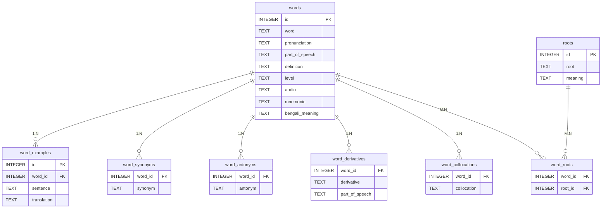

# DATABASE SCHEMA SPECIFICATION

This document outlines the SQLite database structure (`wordsmart.db`) used to store the dictionary, flashcards, stories, and quiz data for local device querying in Flutter.

---

## 📐 Entity Relationship Diagram

---

## 🗂️ Table Schema Specifications

### 1. `words` (Primary Vocabulary Entries)
Contains all vocabulary records (822 core words + 1091 stub entries for synonyms/antonyms).
*   `id`: `INTEGER PRIMARY KEY AUTOINCREMENT`
*   `word`: `TEXT NOT NULL UNIQUE`
*   `pronunciation`: `TEXT`
*   `part_of_speech`: `TEXT`
*   `definition`: `TEXT`
*   `level`: `TEXT` (beginner, intermediate, advanced)
*   `audio`: `TEXT` (relative path to MP3 asset)
*   `mnemonic`: `TEXT`
*   `bengali_meaning`: `TEXT`

### 2. `word_examples` (Bilingual Example Sentences)
*   `id`: `INTEGER PRIMARY KEY AUTOINCREMENT`
*   `word_id`: `INTEGER REFERENCES words(id) ON DELETE CASCADE`
*   `sentence`: `TEXT NOT NULL`
*   `translation`: `TEXT NOT NULL`

### 3. `word_synonyms` (1:N Synonyms)
*   `word_id`: `INTEGER REFERENCES words(id) ON DELETE CASCADE`
*   `synonym`: `TEXT NOT NULL`

### 4. `word_antonyms` (1:N Antonyms)
*   `word_id`: `INTEGER REFERENCES words(id) ON DELETE CASCADE`
*   `antonym`: `TEXT NOT NULL`

### 5. `word_derivatives` (1:N Derivatives)
*   `word_id`: `INTEGER REFERENCES words(id) ON DELETE CASCADE`
*   `derivative`: `TEXT NOT NULL`
*   `part_of_speech`: `TEXT`

### 6. `word_collocations` (1:N Collocations)
*   `word_id`: `INTEGER REFERENCES words(id) ON DELETE CASCADE`
*   `collocation`: `TEXT NOT NULL`

### 7. `roots` (Etymological Roots)
*   `id`: `INTEGER PRIMARY KEY AUTOINCREMENT`
*   `root`: `TEXT NOT NULL UNIQUE`
*   `meaning`: `TEXT NOT NULL`

### 8. `word_roots` (M:N Word-to-Root Mapping Table)
*   `word_id`: `INTEGER REFERENCES words(id) ON DELETE CASCADE`
*   `root_id`: `INTEGER REFERENCES roots(id) ON DELETE CASCADE`

---

## ⚡ Performance Optimizations & Indexes

To ensure fast lookup on low-resource mobile devices, the SQLite builder automatically provisions indexes on foreign keys and search fields:
*   `idx_words_word` on `words(word)`
*   `idx_word_examples_word_id` on `word_examples(word_id)`
*   `idx_word_synonyms_word_id` on `word_synonyms(word_id)`
*   `idx_word_antonyms_word_id` on `word_antonyms(word_id)`
*   `idx_word_derivatives_word_id` on `word_derivatives(word_id)`
*   `idx_word_collocations_word_id` on `word_collocations(word_id)`
*   `idx_word_roots_ids` on `word_roots(word_id, root_id)`
