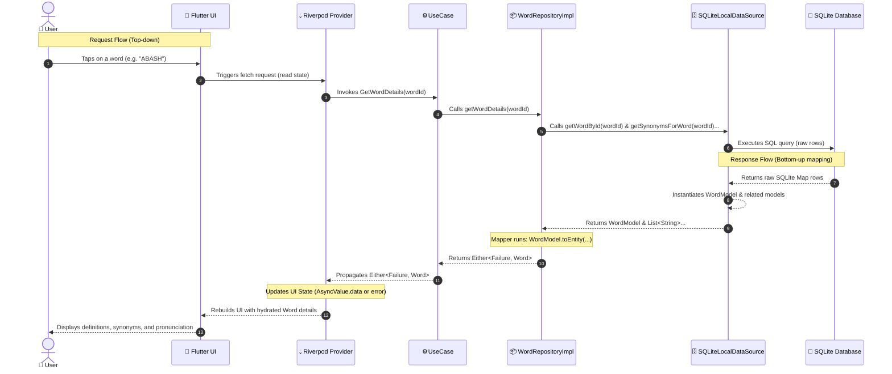

# WordSmart Complete Data Flow

This document details the complete end-to-end data flow (request and response cycle) for the WordSmart mobile client application.

---

## 🗺️ Complete Data Flow Diagram

---

## 🔍 Detailed Data Flow Step-by-Step

### 1. 👤 User & 📱 UI (Presentation Layer)
* **Action:** The user triggers an interaction on the screen (e.g., typing a search keyword or clicking on a specific word in the hit list).
* **Boundary:** The UI does not know anything about databases or business rules. It only reacts to the reactive state exposed by Riverpod.

### 2. 💧 Riverpod Provider (State Management)
* **Action:** Captures the UI intent, switches its internal status to `loading`, and invokes the corresponding Use Case.
* **Boundary:** The provider handles UI state transitions (`loading`, `data`, `error`) and manages dependency injection for the Use Cases.

### 3. ⚙️ UseCase (Domain Layer - Rules)
* **Action:** Orchestrates the application logic. It requests data from the Repository contract.
* **Boundary:** The Use Case depends on abstract interfaces (DIP) and works only with Domain Entities and Failures. It does not know whether data comes from SQLite or a remote server.

### 4. 📦 Repository Implementation (Data Layer - Coordinator)
* **Action:** Catches raw exceptions, coordinates calls to multiple data sources (e.g., getting the core word + lazy-loading synonyms/examples in parallel), runs the mapping logic, and returns a safe `Either<Failure, Entity>`.
* **Boundary:** Implements the Domain Repository contract, acting as a translator between Data and Domain layers.

### 5. 🗄️ Local Data Source (Data Layer - Driver Interface)
* **Action:** Queries SQLite and converts the resulting database rows (`Map<String, dynamic>`) into raw Storage Models.
* **Boundary:** Interface-based abstract contract (`WordLocalDataSource`) so the database engine can be swapped seamlessly in the future without affecting the Repository.

### 6. 💾 SQLite Database & 📦 Models (Storage Layer)
* **Action:** Executes SQL statements and returns tabular data. The raw maps are instantly parsed by `.fromDatabase()` factories into `WordModel`, `WordExampleModel`, etc.
* **Boundary:** Lowest layer. Directly reflects the database schema tables.

### 7. 🔄 Mapper Layer (Transformation)
* **Action:** Pure functions (Dart Extensions) transform the raw storage models (`WordModel`) into safe domain entities (`Word`), running constructors and validating invariants on-the-fly.

---

## 🌟 Architectural Benefits

1. **Testability:** Every arrow in the sequence diagram can be mocked independently.
2. **Thread Safety:** Immutability is preserved from the database mapping step upwards.
3. **Decoupling:** Swapping SQLite for Hive/API only changes the DataSource implementation; no UI or Use Case code is modified.
