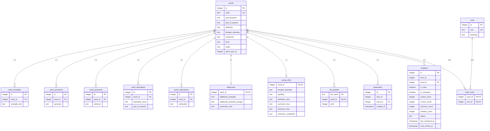

# WordSmart Entity Relationships

## Word ↔ Root

**Relationship:**
Many-to-Many

**Reason:**
* A word can have multiple roots.
* A root can belong to multiple words.

---

## Word ↔ Flashcard

**Relationship:**
One-to-One

**Reason:**
* Each word has a single flashcard representation.

---

## Word ↔ Bookmark

**Relationship:**
One-to-Many

**Reason:**
* Bookmark is an associative entity (connecting User and Word).
* A single word can be bookmarked by multiple users (generating multiple bookmark records).
* Each bookmark record maps to exactly one word.

---

## Word ↔ Progress

**Relationship:**
One-to-Many

**Reason:**
* Each user has separate progress data for a word.

---

## Word ↔ Story

**Relationship:**
Many-to-Many

**Reason:**
* A story contains many words.
* A word can appear in many stories.

---

## Word ↔ Quiz

**Relationship:**
Many-to-Many

**Reason:**
* A quiz contains many words.
* A word can appear in many quizzes.

---

# Real WordSmart Schema (Current Thinking)

## Entity to Table Mapping

* **Word** → `words`
* **Root** → `roots`
* **WordRoot** → `word_roots`
* **Example** → `word_examples`
* **Derivative** → `word_derivatives`
* **Synonym** → `word_synonyms`
* **Antonym** → `word_antonyms`
* **Collocation** → `word_collocations`
* **Bookmark** → `bookmarks`
* **Progress** → `progress`

---

## Entity Relationship Diagram (ERD)

---

## Table Schemas & Constraints

### 1. Core Dictionary Tables

#### `words` (Primary Vocabulary Registry)
Defines all vocabulary words in the system. Holds the 822 main WordSmart I words along with 1,091 secondary words (roots and hit parades lists) inserted as stubs for referential integrity.
*   `id`: `INTEGER PRIMARY KEY` (matching original source JSON IDs for main words, auto-incrementing for secondary stubs).
*   `word`: `TEXT UNIQUE NOT NULL` (guarantees that no vocabulary word is duplicated).
*   `pronunciation`: `TEXT` (nullable for stubs).
*   `part_of_speech`: `TEXT` (nullable for stubs).
*   `definition`: `TEXT` (nullable for stubs).
*   `bengali_meaning`: `TEXT` (nullable for stubs).
*   `mnemonic`: `TEXT` (nullable).
*   `level`: `TEXT` (nullable).
*   `audio`: `TEXT` (nullable).
*   `quick_quiz_id`: `INTEGER` (nullable).

#### `word_examples` (1:N Examples)
Stores contextual usage sentences for words.
*   `id`: `INTEGER PRIMARY KEY AUTOINCREMENT`
*   `word_id`: `INTEGER NOT NULL`
*   `example_text`: `TEXT NOT NULL`
*   *Foreign Key:* `word_id REFERENCES words(id) ON DELETE CASCADE`

#### `word_synonyms` & `word_antonyms` (1:N Lexical Relations)
Stores synonyms and antonyms.
*   `id`: `INTEGER PRIMARY KEY AUTOINCREMENT`
*   `word_id`: `INTEGER NOT NULL`
*   `synonym` / `antonym`: `TEXT NOT NULL`
*   *Foreign Key:* `word_id REFERENCES words(id) ON DELETE CASCADE`

#### `word_derivatives` (1:N Etymological Derivatives)
Enables searching word forms (e.g. searching "abashment" directs to "abash").
*   `id`: `INTEGER PRIMARY KEY AUTOINCREMENT`
*   `word_id`: `INTEGER NOT NULL`
*   `derivative_word`: `TEXT NOT NULL`
*   `part_of_speech`: `TEXT NOT NULL`
*   *Foreign Key:* `word_id REFERENCES words(id) ON DELETE CASCADE`

#### `word_collocations` (1:N Collocations)
Stores common word partnerships.
*   `id`: `INTEGER PRIMARY KEY AUTOINCREMENT`
*   `word_id`: `INTEGER NOT NULL`
*   `collocation`: `TEXT NOT NULL`
*   *Foreign Key:* `word_id REFERENCES words(id) ON DELETE CASCADE`

---

### 2. Root Analysis Tables

#### `roots` (Lookup Table for Latin/Greek Roots)
*   `id`: `INTEGER PRIMARY KEY AUTOINCREMENT`
*   `root`: `TEXT UNIQUE NOT NULL` (prevents duplication of root tokens).
*   `meaning`: `TEXT NOT NULL`

#### `word_roots` (N:M Word-Root Association)
*   `word_id`: `INTEGER NOT NULL`
*   `root_id`: `INTEGER NOT NULL`
*   *Primary Key:* `(word_id, root_id)` (composite key, avoids duplicate mapping).
*   *Foreign Key:* `word_id REFERENCES words(id) ON DELETE CASCADE`
*   *Foreign Key:* `root_id REFERENCES roots(id) ON DELETE CASCADE`

---

### 3. User-specific Tracking Tables

#### `bookmarks` (One-to-Many User Bookmarks associative entity)
Allows users to save words for later study.
*   `id`: `INTEGER PRIMARY KEY AUTOINCREMENT`
*   `user_id`: `INTEGER NOT NULL`
*   `word_id`: `INTEGER NOT NULL`
*   `created_at`: `TIMESTAMP DEFAULT CURRENT_TIMESTAMP`
*   *Constraints:* `UNIQUE(user_id, word_id)` (prevents double bookmarks).
*   *Foreign Key:* `word_id REFERENCES words(id) ON DELETE CASCADE`

#### `progress` (One-to-Many User Progress tracking table)
Tracks learning states and spaced repetition history.
*   `id`: `INTEGER PRIMARY KEY AUTOINCREMENT`
*   `user_id`: `INTEGER NOT NULL`
*   `word_id`: `INTEGER NOT NULL`
*   `is_read`: `BOOLEAN DEFAULT 0`
*   `is_reviewed`: `BOOLEAN DEFAULT 0`
*   `review_count`: `INTEGER DEFAULT 0`
*   `correct_count`: `INTEGER DEFAULT 0`
*   `incorrect_count`: `INTEGER DEFAULT 0`
*   `mastery_score`: `INTEGER DEFAULT 0` (0-100)
*   `status`: `TEXT DEFAULT 'unlearned'`
*   `last_reviewed_at`: `TIMESTAMP`
*   `next_review_at`: `TIMESTAMP`
*   *Constraints:* `UNIQUE(user_id, word_id)` (prevents duplicate progress records).
*   *Foreign Key:* `word_id REFERENCES words(id) ON DELETE CASCADE`

---

### 4. Learning Features & Auxiliary Tables

#### `flashcards` (1:1 Study Cards)
Stores unique flashcard hints and extra examples. Other properties (definition, synonyms, etc.) are fetched from parent tables.
*   `word_id`: `INTEGER PRIMARY KEY REFERENCES words(id) ON DELETE CASCADE`
*   `additional_example`: `TEXT` (unique flashcard example sentence)
*   `additional_example_bengali`: `TEXT` (translation of additional example)
*   `mnemonic_hint`: `TEXT` (interactive memory mnemonic text)

#### `vocab_drills` (1:1 5-Step Exercises)
*   `word_id`: `INTEGER PRIMARY KEY REFERENCES words(id) ON DELETE CASCADE`
*   `bengali_meaning`: `TEXT NOT NULL`
*   `spelling` / `definition_mcq` / `synonym_mcq` / `antonym_mcq` / `sentence_completion`: `TEXT NOT NULL` (JSON Objects)

#### `hit_parades` (N:1 Word Lists)
*   `list_name`: `TEXT NOT NULL`
*   `word_id`: `INTEGER NOT NULL REFERENCES words(id) ON DELETE CASCADE`
*   `rank`: `INTEGER NOT NULL`
*   *Primary Key:* `(list_name, word_id)`

#### Other Tables (`contextual_stories`, `mcq_quizzes`, `quick_quizzes`, `advanced_sat_gre_quizzes`, `specialized_vocabulary`, `final_exam`)
Store quiz questions, story text, translation mapping datasets, and specialized domains loaded directly from their corresponding JSON source files.

