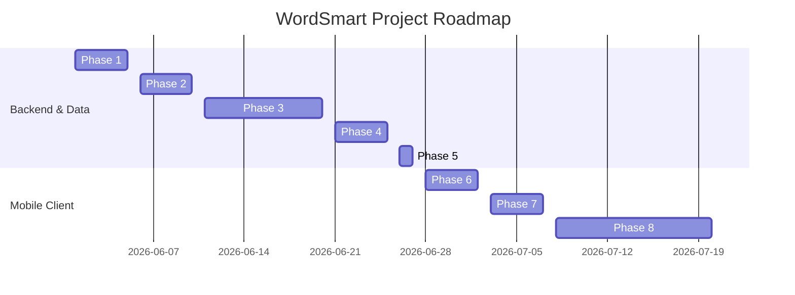

# DEVELOPMENT ROADMAP

This document outlines the finished and upcoming milestones of the WordSmart application.

---

## 🗺️ Development Roadmap

---

## 🔄 Status of Phases

### Phase 1: Requirements ✅
*   Defined the core GRE/SAT/IELTS word list.
*   Established standard templates for definitions, phonetic pronunciations, mnemonics, example sentences, synonyms, and antonyms.

### Phase 2: Data Collection ✅
*   Extracted vocabulary data from raw sources (*Word Smart I*).
*   Compiled initial data sets into structured formats.

### Phase 3: Data Enrichment ✅
*   *Bengali Example Translations:* Batch-translated all 2,353 book example sentences into natural, colloquial Bengali using Gemini API.
*   *Popular Collocations:* Added 3 to 5 lowercase collocations per word (total 3,434 collocations) using AI-assisted generation.
*   *Validation Audits:* Replaced all Devanagari/Hindi letters with correct Bengali Unicode and validated formatting.

### Phase 4: Database Design ✅
*   Designed relational database schema mapping words, roots, examples, synonyms, antonyms, and collocations.
*   Implemented automated migrations to import JSON data into SQLite (`wordsmart.db`).

### Phase 5: Project Stabilization (NOW) ✅
*   Reorganized directory structure (Source data in `data/source`, SQLite in `data/database`, Caches in `archive/cache/`, Assets in `assets/audio`).
*   Created programmatic path update utility `reorganize_project.py` to adapt scripts.
*   Created robust collocation QA validator `validate_collocations.py`.
*   Standardized repository documentation.

---

## ⏳ Future Milestones (Mobile Client)

### Phase 6: Flutter Architecture & Foundation (Frozen & Stabilized) ✅
*   Initialize core folder structures (`app/lib/domain` and `app/lib/data`).
*   Establish Domain Entities with strict invariants validation.
*   Setup custom Exceptions for runtime safety in production.
*   Design Repository contracts and implement `WordRepositoryImpl` for `getWordDetails`.
*   Establish Unit Test structure under `app/test/` to validate critical repository execution paths.

### Phase 7: Vertical Slices Feature Development (Current Milestone)
*   **Mantra:** *"No more horizontal architecture work. From now on, every session should deliver one complete vertical feature."*
*   **Slice 1: Search Feature (End-to-End)**
    *   Implement `SearchWordsUseCase` & `GetSearchSuggestionsUseCase`.
    *   Set up dependency injection and Riverpod providers.
    *   Build complete Search UI Screen.
*   **Slice 2: Word Details Feature (End-to-End)**
    *   Implement `GetWordDetailsUseCase`.
    *   Set up Riverpod StateNotifier/ChangeNotifier for details hydration.
    *   Build Details Screen (pronunciation audio players, derivatives, collocations, etymology roots).
*   **Slice 3: Bookmark Feature (End-to-End)**
    *   Implement Bookmark Use Cases.
    *   Build Bookmark toggle buttons in Details Screen and Bookmark listing UI.
*   **Slice 4: Spaced-Repetition Progress Feature (End-to-End)**
    *   Implement progress update & due reviews Use Cases.
    *   Build card swipe recall UI and learning analytics dashboard.

### Phase 8: Quiz, Stories Slices & Launch
*   **Slice 5: Vocabulary Quizzes (End-to-End)**
    *   Implement MCQ, spelling, and matching drills Use Cases and UI.
*   **Slice 6: Dual-Language Stories (End-to-End)**
    *   Implement dual-language story loading and reading UI.
*   **App Release Packaging:** Deploy production Android Bundle/APK & iOS IPA.
