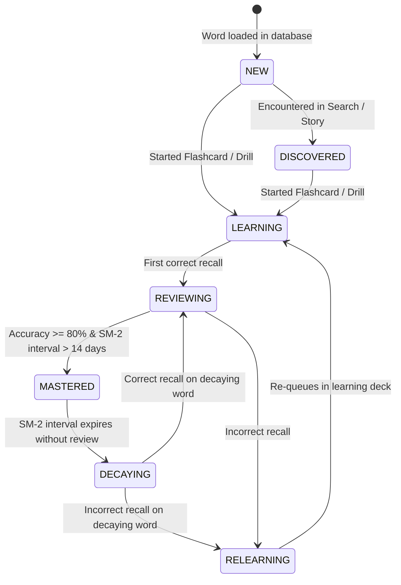

# WordSmart Learning Engine Architecture Specification

Version: 1.1  
Category: Learning & Recommendation Architecture

WordSmart transitions from a traditional dictionary lookup tool into a personalized, learning-centric vocabulary platform. This document defines the components, schemas, and algorithms of the three primary engine blocks: the **Learning Engine**, **Recommendation Engine**, and **Progress Engine**.

---

## 🏛️ 1. Conceptual Architecture Diagram

```text
                                    User
                                      │
                                      │
                            ┌─────────┴─────────┐
                            │                   │
                      User Preferences     Learning Profile
                            │                   │
                            └─────────┬─────────┘
                                      │
                               Recommendation Engine
                                      │
              ┌────────┬────────┬─────┴──┬────────┐
              │        │        │        │        │
            Search   Review   Stories   Quiz   Daily Goal
              │        │        │        │        │
              └────────┴────────┴─────┬──┴────────┘
                                      │
                               Progress Engine
                                      │
                                word_progress
                                      │
                           SQLite Knowledge Graph
```

---

## ⚙️ 2. Core Engines

### A. Progress Engine & Learning States

#### 1. Vocabulary Word Learning States (The Heart of WordSmart)
Every vocabulary word exists in one of the following states. Transitions are triggered dynamically by user interactions:



*   **NEW:** In database, never seen by user.
*   **DISCOVERED:** Encountered in search or read inside a story, but not yet active in flashcards.
*   **LEARNING:** Active in flashcards/drills but has not reached mastery thresholds.
*   **REVIEWING:** Retained with high accuracy; actively tested in spaced repetition cycles.
*   **MASTERED:** Mastery score $\ge 80$, long review interval ($>14$ days).
*   **DECAYING:** Active review interval expired; word needs immediate revision.
*   **RELEARNING:** Incorrect recall during review; returns to the learning deck.

#### 2. The Learning Signal Matrix
Memory retrieval strength is computed dynamically when a user answers questions inside Quizzes, Flashcards, or Drills:

| Correctness | Retrieval Speed | Hint Used | Memory Strength Score | Progress Adjustment |
| :--- | :--- | :--- | :--- | :--- |
| **Correct** | Fast ($< 3\text{s}$) | No | **Strong (5/5)** | Mastery $+25$ points; Interval multiplier $1.8\times$ |
| **Correct** | Moderate ($3\text{–}10\text{s}$) | No | **Medium-Strong (4/5)** | Mastery $+15$ points; Interval multiplier $1.4\times$ |
| **Correct** | Slow ($> 10\text{s}$) | Yes | **Weak-Correct (3/5)** | Mastery $+5$ points; Interval multiplier stays $1.0\times$ |
| **Incorrect** | Any speed | Yes/No | **Failed (0/5)** | Mastery $-20$ points; Interval reset to $1$ day |

---

### B. Recommendation Engine

#### 1. Content Scoring Algorithm
At Home screen launch, candidate activities are scored using the following multiplicative formula:

$$\text{Recommendation Score} = \text{Urgency} \times \text{Importance} \times \text{Confidence} \times \text{Freshness}$$

*   **Urgency:** Time elapsed since the word was last reviewed (higher reviews due = higher score).
*   **Importance:** Weighted frequency priority (e.g. GRE/SAT Hit Parade tier words rank higher).
*   **Confidence:** Inverse of user's mastery level (weaker words get higher scores to prompt reviews).
*   **Freshness:** Penalty for words recently encountered or searched to ensure variety.

#### 2. Home Page Recommendations Block Hierarchy
1.  **Review Due Card:** If due reviews exist. Shows reviews due count and estimated minutes to complete.
2.  **Weak Word Alert Card:** Identifies words the user frequently confuses (e.g., *ABATE* vs *ABASH*) based on spelling/meaning errors.
3.  **Continue Reading Story:** Based on the last reading position of an active story.
4.  **Recommended Root:** Displays an etymological root and its word family.
5.  **Daily Challenge:** A 1-minute `quick_quiz` matchup challenge.

---

### C. Study Session & Milestones Engine
Tracks daily progress against concrete learning metrics rather than childish gamified XP values.
*   **Streak Metrics:** Streak increments when the user achieves daily goals:
    *   `target_reviews` / `completed_reviews`
    *   `target_words` / `completed_words`
    *   `study_minutes` (tracked via active session timers).
*   **Milestones:** Replaces gamified achievements with reading/learning benchmarks:
    *   *100 Words Learned*
    *   *First Story Finished*
    *   *Root Explorer*
    *   *Completed SAT Hit Parade*

---

## 🗂️ 3. Extended Database Schema

To support these tracking capabilities, the SQLite database is extended with the following tables:

### 1. `learning_profile` (Core Analytics Registry)
```sql
CREATE TABLE learning_profile (
    user_id INTEGER PRIMARY KEY,
    preferred_learning_mode TEXT,        -- 'flashcards', 'quiz', 'stories'
    average_accuracy REAL DEFAULT 0.0,
    average_response_time REAL DEFAULT 0.0,
    current_streak INTEGER DEFAULT 0,
    longest_streak INTEGER DEFAULT 0,
    strongest_category TEXT,
    weakest_category TEXT,
    updated_at TIMESTAMP DEFAULT CURRENT_TIMESTAMP
);
```

### 2. `study_sessions` (Aggregate Session Logging)
```sql
CREATE TABLE study_sessions (
    id INTEGER PRIMARY KEY AUTOINCREMENT,
    started_at TIMESTAMP DEFAULT CURRENT_TIMESTAMP,
    ended_at TIMESTAMP,
    mode TEXT NOT NULL,                  -- 'flashcards', 'quiz', 'story_reader', 'mock_exam'
    words_encountered_count INTEGER DEFAULT 0,
    correct_answers_count INTEGER DEFAULT 0,
    score_percentage REAL,
    duration_seconds INTEGER DEFAULT 0,
    ended_normally BOOLEAN DEFAULT 1     -- Tracks if user quit app abruptly
);
```

### 3. `search_history` (Contextual Analytics)
```sql
CREATE TABLE search_history (
    id INTEGER PRIMARY KEY AUTOINCREMENT,
    query_text TEXT NOT NULL,
    word_id_opened INTEGER REFERENCES words(id) ON DELETE SET NULL,
    opened_from TEXT NOT NULL,           -- 'search', 'story', 'bookmark', 'review', 'recommendation', 'home'
    searched_at TIMESTAMP DEFAULT CURRENT_TIMESTAMP,
    view_duration_seconds INTEGER DEFAULT 0
);
```

### 4. `story_progress` (Word-level Reading Tracker)
```sql
CREATE TABLE story_progress (
    id INTEGER PRIMARY KEY AUTOINCREMENT,
    story_id INTEGER REFERENCES contextual_stories(quiz_id) ON DELETE CASCADE,
    reading_position TEXT DEFAULT '0.0', -- Store as scroll offset percentage
    is_completed BOOLEAN DEFAULT 0,
    updated_at TIMESTAMP DEFAULT CURRENT_TIMESTAMP
);
```

### 5. `quiz_attempts` (Detailed Testing Logs)
```sql
CREATE TABLE quiz_attempts (
    id INTEGER PRIMARY KEY AUTOINCREMENT,
    quiz_id INTEGER,                     -- Reference to mcq_quizzes, quick_quizzes, or advanced_quizzes
    quiz_type TEXT NOT NULL,             -- 'mcq', 'quick', 'advanced', 'mock_exam'
    score INTEGER NOT NULL,
    total_questions INTEGER NOT NULL,
    attempted_at TIMESTAMP DEFAULT CURRENT_TIMESTAMP
);
```

### 6. `learning_events` (Unified Learning Stream)
```sql
CREATE TABLE learning_events (
    id INTEGER PRIMARY KEY AUTOINCREMENT,
    user_id INTEGER NOT NULL,
    event_type TEXT NOT NULL,            -- 'word_opened', 'word_read', 'story_started', 'story_finished', 'review_completed', 'quiz_completed', 'bookmark_added'
    reference_id INTEGER NOT NULL,       -- Matches word_id, story_id, or quiz_id
    logged_at TIMESTAMP DEFAULT CURRENT_TIMESTAMP
);
```

### 7. `weak_word_events` (Granular Diagnostic Log)
```sql
CREATE TABLE weak_word_events (
    id INTEGER PRIMARY KEY AUTOINCREMENT,
    word_id INTEGER REFERENCES words(id) ON DELETE CASCADE,
    reason TEXT NOT NULL,                -- 'SPELLING', 'MEANING', 'SYNONYM', 'PRONUNCIATION', 'ROOT'
    occurred_at TIMESTAMP DEFAULT CURRENT_TIMESTAMP
);
```

### 8. `daily_goals` (Activity Metric Tracking)
```sql
CREATE TABLE daily_goals (
    goal_date DATE PRIMARY KEY,
    target_reviews INTEGER DEFAULT 15,
    completed_reviews INTEGER DEFAULT 0,
    target_words INTEGER DEFAULT 10,
    completed_words INTEGER DEFAULT 0,
    target_minutes INTEGER DEFAULT 15,
    completed_minutes INTEGER DEFAULT 0,
    is_completed BOOLEAN DEFAULT 0
);
```

### 9. `milestones` (Milestones Registry)
```sql
CREATE TABLE milestones (
    id TEXT PRIMARY KEY,                 -- e.g. 'words_learned_100', 'first_story_finished', 'sat_hit_parade_completed'
    title TEXT NOT NULL,
    description TEXT,
    unlocked_at TIMESTAMP DEFAULT CURRENT_TIMESTAMP
);
```

### 10. `bookmarks` (Reason Tagging Extension)
```sql
CREATE TABLE bookmarks (
    id INTEGER PRIMARY KEY AUTOINCREMENT,
    user_id INTEGER NOT NULL,
    word_id INTEGER NOT NULL,
    reason TEXT DEFAULT 'Review Later',  -- 'Favorite', 'Review Later', 'Exam Focus', 'Interesting'
    created_at TIMESTAMP DEFAULT CURRENT_TIMESTAMP,
    UNIQUE(user_id, word_id),
    FOREIGN KEY (word_id) REFERENCES words(id) ON DELETE CASCADE
);
```
