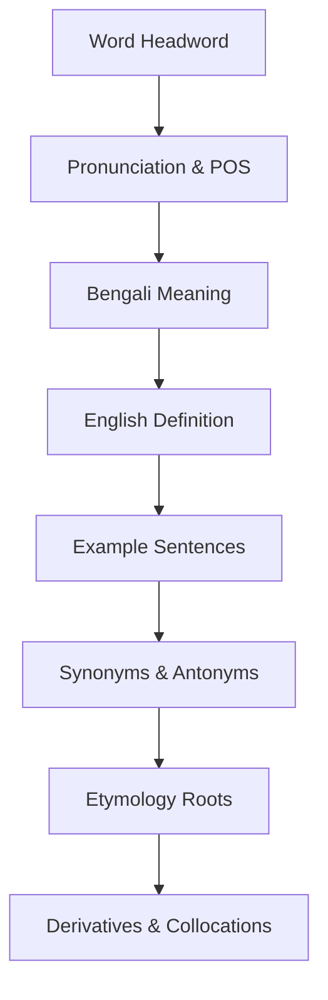

# WordSmart UI/UX Design Principles

This document defines the visual, interactional, and architectural design principles of the WordSmart platform. All feature layouts and screens must comply with these guidelines.

---

## 🏛️ 1. Design Philosophy
WordSmart is a premium vocabulary reading and learning platform for adults. The user interface exists solely to support vocabulary acquisition and reading comprehension; it must never compete visually with the learning content.

---

## 🎯 2. Design Goal (The 3-Second Rule)
Every screen must clearly answer a single primary user question: *"What should I do next?"* The user should be able to identify and initiate the primary action within **3 seconds** of landing on the screen.

---

## 📖 3. Content First
The vocabulary word is the absolute hero of the layout. Secondary decorative items must never distract from or overpower the primary term.
*   **Visual Reading Priority Flow:**
    `Word Headword` $\rightarrow$ `Bengali Translation` $\rightarrow$ `English Definition` $\rightarrow$ `Metadata Details` $\rightarrow$ `Primary Actions`.

---

## 🔄 4. Progressive Disclosure
Vocabulary information is revealed dynamically as the user scrolls or interacts, keeping reading panes minimal:

---

## 📐 5. Calm Visual Rhythm
Use whitespace intentionally to let layout pages breathe. Every container margin and padding aligns to a strict **8dp baseline grid** (avoiding crowded lists, border frames, or nested outlines).

---

## 🧭 6. Navigation Depth & Flow
The navigation flow remains shallow and linear to prevent users from getting lost:
*   **Maximum Target Depth:** `Home` $\rightarrow$ `Search Suggestions` $\rightarrow$ `Word Details`.
*   Avoid multi-nested routes, floating overlays, or double back paths. Every sub-page features a top-left back chevron button $(<)$.

---

## ⏳ 7. Loading States & Perceived Performance
*   Never show raw, spinning indicators for main content pages.
*   Pulsing skeletons (`#1E1E1E` transitioning to `#262626` over `1200ms`) must mimic the incoming card layout structures precisely.
*   New loaded content fades in over `200ms` rather than snapping abruptly.

---

## 📐 8. Responsive Capping
WordSmart adapts responsively across form factors:
*   **Phones (<600dp):** Vertical scroll lists, `24dp` margins.
*   **Tablets (600–840dp):** Double-column vertical scroll layouts.
*   **Desktops (>840dp):** Reading column layouts capped at `800dp` maximum width.
