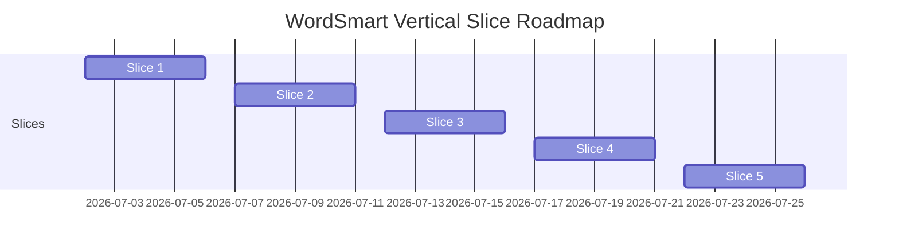

# WordSmart Vertical Slice Implementation Plan

This implementation plan defines the development roadmap for WordSmart following the **UI $\rightarrow$ Vertical Slice $\rightarrow$ Refine $\rightarrow$ Repeat** workflow. Instead of designing the entire app upfront, we will design, code, and refine one cohesive vertical slice at a time.

---

## 📅 Vertical Slice Roadmap

---

## 🎯 Repeatable Slice Development Checklist
For every slice in the roadmap, we will execute the following 18-step workflow:
*   **0. Pre-flight:**
    *   [ ] Feature branch created.
    *   [ ] Dependencies updated.
    *   [ ] Existing tests passing.
    *   [ ] Database migration number reserved (if modifying SQLite schema).
*   **1. Screen Spec:** Document target layout and states in markdown.
*   **2. Stitch Mockup:** Wireframe visual states inside Stitch.
*   **3. Component Design:** Extract and update visual components in the Design System.
*   **4. Domain API:** Declare domain entity models and repository interfaces.
*   **5. SQLite Queries:** Code database tables migrations and repository raw queries.
*   **6. Repository:** Implement repositories mapping data sources to domain contracts.
*   **7. Use Cases:** Code application interactor logic blocks.
*   **8. Providers:** Initialize Riverpod state notifiers.
*   **9. UI:** Assemble pages using the Design System component library.
*   **10. Unit Tests:** Test domain use cases and repository contracts.
*   **11. Integration Tests:** Verify E2E flows (e.g. Type query $\rightarrow$ Open details $\rightarrow$ Bookmark $\rightarrow$ Persist).
*   **12. Performance:** Audit render rebuilds and database latency using DevTools.
*   **13. Refactor:** Clean up code, remove code duplication, optimize widget tree depth.
*   **14. Documentation:** Update API docs, schema schemas, and CHANGELOG.
*   **15. Self Code Review:**
    *   [ ] No dead code or unused imports left.
    *   [ ] No temporary `TODO` comments left.
    *   [ ] No debug prints (`print()`) remaining.
    *   [ ] Variable and class naming is consistent with Clean Architecture guidelines.
    *   [ ] Public APIs and use cases are clearly documented.
*   **16. Release Notes:** Document a brief, one-sentence release note for the completed slice.
*   **17. Merge:** Commit, push, and merge the completed feature branch to main.

---

## 🎯 Current Slice Focus: Slice 1 (Search & Word Details)

We will build the core offline dictionary experience. Upon completion, users can search for any of the 1,900+ words, view suggestions, click exact matches, and read comprehensive etymological, mnemonic, and relational definitions.

### 🎨 Step 1: UI Mockup & Spec Verification (Stitch)
*   **Search Screen:** Design high-fidelity mocks in Stitch for `Initial` (history/popular lists fallback), `Typing` (autocomplete suggestions), `Results` (separated Exact Match card + Related Results list), and `No Results` states.
*   **Word Details Screen:** Design the collapsible sliver header details page layout containing POS, phonetics, Bengali meaning, English definition, mnemonics, example lists, synonym/antonym chips, and study actions.

### ⚙️ Step 2: Vertical Slice Implementation
We will implement the entire data-to-UI stack for the feature set:
1.  **SQLite Layer:** Bind helper client to read `/assets/database/wordsmart.db` locally.
2.  **Data Sources Layer:** Create `local_database_datasource.dart` and preferences store.
3.  **Repositories Layer:** Implement `WordRepositoryImpl` and `SearchRepositoryImpl` according to domain contracts.
4.  **Domain Use Cases:** Implement interactor classes `SearchWords` and `GetWordDetails`.
5.  **Presentation Providers:** Initialize Riverpod state notifiers `SearchNotifier` and `WordDetailsNotifier`.
6.  **Presentation UI:** Implement the Material 3 `SearchPage`, `WordDetailsPage`, and reusable components (SearchBar, Featured Card, WordHeader, DefinitionBlock, SectionHeader, PrimaryButton, AudioButton, BookmarkButton, LoadingSkeleton, EmptyState).
7.  **Component Extraction:** Move reusable UI elements into the Design System module immediately during development to prevent widget code duplication.

### 🔍 Step 3: Architecture & Performance Review
Before deploying to device execution, evaluate the code against this architecture validation checklist:
*   [ ] Did the UI call repositories directly (violating Use Case boundaries)?
*   [ ] Is there any SQL code inside Presentation Providers or UI pages?
*   [ ] Does the Presentation layer contain core business rules or logic operations?
*   [ ] Do UI widgets or components import `sqflite` or file-system direct access packages?

### 🔍 Step 4: Run, Verify & Refine
*   Run the app on simulators/devices.
*   Launch Flutter DevTools and evaluate performance metrics:
    *   **Performance Overlay:** Inspect frame rendering times and detect animation jank.
    *   **Rebuild Inspector:** Identify redundant parent widget rebuild cycles during keystrokes.
    *   **Memory / Query:** Audit SQLite execution latency and pre-cached image footprints.
*   Refine UI spacing, code architecture, SQLite queries, tests, and documentation based on live app testing feedback.

---

## 🛑 Definition of Done (DoD) for Slice 1
Slice 1 is complete only when the following goals are verified:
*   [ ] Search ranking algorithm correctly sorts exact headword match $\rightarrow$ prefix match $\rightarrow$ related match.
*   [ ] Exact match card is displayed prominently at the very top of results list.
*   [ ] Word Details page transitions and renders content in under **200ms**.
*   [ ] Hero transition on headword operates cleanly without frame drops.
*   [ ] Pronunciation audio playback plays instantly with a single tap.
*   [ ] Star bookmark toggle updates the local SQLite database state cleanly.
*   [ ] Unit tests pass for search ranking and SM-2 interval calculator.
*   [ ] Integration tests validate complete flow: *Type query $\rightarrow$ Open word details $\rightarrow$ Toggle bookmark $\rightarrow$ Exit $\rightarrow$ Re-enter $\rightarrow$ Bookmark state is persisted*.
*   [ ] App complies with WCAG AA+ high contrast and minimum `48dp` tap targets.
*   [ ] Clean Architecture review passed; code matches all domain contracts.
*   [ ] Documentation updated in `docs/ui/screen_specs/` and `docs/CHANGELOG.md`.
