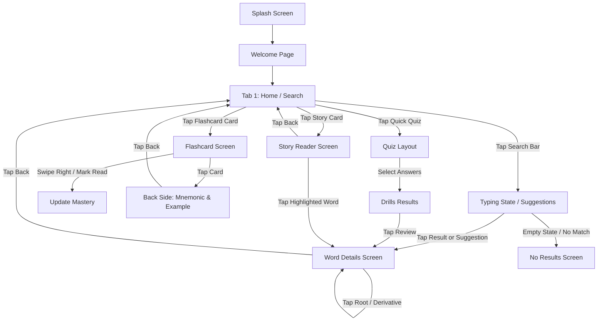

# WordSmart App Navigation & User Flow

This document details the navigation architecture, main tab structure, and key user flows for the WordSmart application.

---

## 🏛️ Navigation Architecture (Main Tabs)

WordSmart uses a **bottom navigation bar** (5-tab layout) on the primary screen. The tabs are:

1.  **Home / Search (Tab 1):** Main dashboard featuring search input, "Word of the Day", continue learning, and quick actions.
2.  **Flashcards (Tab 2):** Card-swipe interface for recall training and spaced-repetition reviews.
3.  **Stories (Tab 3):** Dual-language story reading center.
4.  **Bookmarks (Tab 4):** Simple filterable repository of bookmarked words.
5.  **Progress (Tab 5):** Mastery stats, accuracy metrics, streaks, and learning settings.

---

## 🗺️ User Flow Map

---

## 🔄 Sequence of User Flows

### 1. The Search to Detail Loop
*   **Trigger:** User taps the search bar and types.
*   **Path:** Search bar reveals suggestions $\rightarrow$ User selects a suggestion or hits enter $\rightarrow$ Search results display matching list $\rightarrow$ User selects word $\rightarrow$ Word Details screen opens.
*   **Loop:** Inside Details, user taps a synonym $\rightarrow$ Details transitions to the synonym's page $\rightarrow$ Tapping "Back" returns the user through the navigation stack trace recursively.

### 2. The Spaced-Repetition Review Loop
*   **Trigger:** User taps "Review Due" quick action on Home screen.
*   **Path:** Flashcard deck opens populated with due words $\rightarrow$ User views front card $\rightarrow$ Taps to flip $\rightarrow$ Views back card (mnemonic, example, translation) $\rightarrow$ Swipes right (correct recall) or left (incorrect) $\rightarrow$ System updates `WordProgress` database table $\rightarrow$ Deck concludes $\rightarrow$ Returns user to Home.

### 3. The Contextual Story Learning Loop
*   **Trigger:** User opens a story.
*   **Path:** Reader displays English text with bilingual translation toggle $\rightarrow$ User reads $\rightarrow$ Hits highlighted GRE vocabulary word in-sentence $\rightarrow$ Bottom sheet or overlay card appears displaying definition and translation $\rightarrow$ User has option to navigate to full Word Details or stay in-context.
